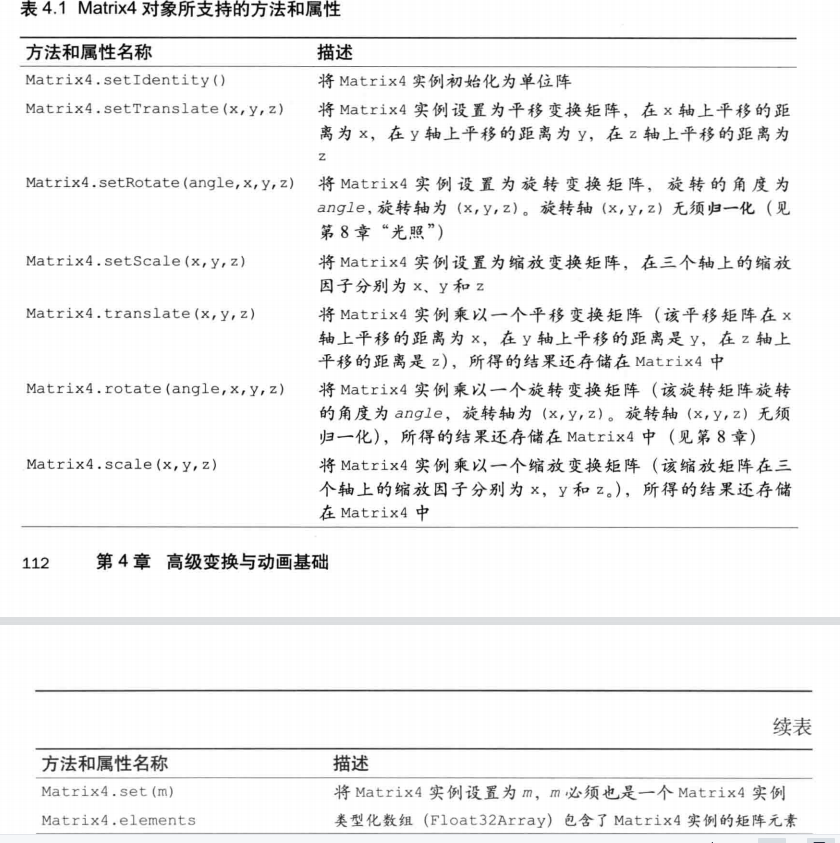

# WebGL 1.0.0

## 

### 绘制多个点

- 缓冲区对象

可以一次性地向着色器传入多个订单的数据。缓冲区对象是WebGL系统中的一块内存区域，我们可以一次性地向缓冲区对象中填充大量的顶点数据，然后将这些数据保存在其中，供顶点着色器使用。

使用缓冲器对象向顶点着色器中传入多个顶点数据需遵循以下五个步骤：

1. 创建缓冲区对象（gl.createBuffer()）
2. 绑定缓冲区对象（gl.bindBuffer()）
3. 将数据写入缓冲区对象（gl.bufferData()）
4. 将缓冲区对象分配给一个attribute变量（gl.vertexAttribPointer()）
5. 开启attribute变量（gl.enableAttribArray()）

**gl.createBuffer()**

| 参数 | 返回值                                   | 异常 |
| ---- | ---------------------------------------- | ---- |
| 无   | null \| 非Null                           | 无   |
|      | 新创建的缓冲区对象 \| 创建缓冲区对象失败 |      |

对应的可用 gl.deleteBuffer(buffer) 删除 由 gl.createBuffer() 创建的缓冲区对象

**gl.bindBuffer()**

将缓冲区绑定在 WebGL 系统中已存在的 target 上。

| 参数(target，webglcontext)                                   | 返回值 | 异常                                             |
| ------------------------------------------------------------ | ------ | ------------------------------------------------ |
| gl.ARRAY_BUFFER: 表示缓冲区对象中包含了顶点的数据<br />gl.ELEMENT_ARRAY_BUFFER: 表示缓冲区对象中包含了点的索引值<br />buffer: 指定之前由gl.createBuffer()返回的待绑定的缓冲区对象<br />null: 禁用对 target 的绑定 | 无     | INVALID_ENUM: target不合法，此时保持原有的绑定。 |

**gl.bufferData()**

在 WebGL 中，不可直接向缓冲区对象中写入数据，只能向 target 中写入，所以需要 gl.bindBuffer() 来绑定 target 与缓冲区对象。

| 参数 （target, data, usage）usage表示如何使用缓冲区对象的数据，用于提升效率 | 返回值 | 异常              |
| ------------------------------------------------------------ | ------ | ----------------- |
| usage:<br />gl.STATIC_DRAW: 向缓冲区中写入一次数据，绘制多次<br />gl.STREAM_DRAW: 向缓冲区中写入一次数据，绘制多次 // todo 监听？？<br />gl.DYNAMIC_DRAW: 写入多次，绘制对此 | 无     | 同gl.bindBuffer() |

**gl.vertexAttribPointer()**

将绑定到 gl.ARRAY_BUFFER 上的缓冲区对象分配给由 location 指定的 attribute 变量

| 参数 (location, size, type, normalized, stride, offset)      | 返回值 | 异常                                                         |
| ------------------------------------------------------------ | ------ | ------------------------------------------------------------ |
| location: 待分配 attribute 变量的存储地址。<br />size: 缓冲区中每个订单分配到的分量个数。若 size 比 attribute 变量需要的分量小，则按照与 gl.vertexAttrib(1234)f相同的规则补全。 即2、3分量默认0.0，4分量默认1.0。<br />type: 指定数据格式<br />          gl.UNSIGNED_BYTE: 无符号字节， Unit8Array<br />          gl.SHORT: 短整型，Int16Array<br />          gl.UNSINGED_SHORT: 无符号短整型， Unit16Arrat<br />          gl.INT: 整型， Int32Array<br />          gl.UNSIGNED_INT: 无符号整型， Unit32Array<br />          gl.FLOAT: 浮点型， Float32Array<br />normalize: 是否将非浮点型数据规划到 [0,1] 或 [-1,-1] 区间<br />          true \| false<br /> stride: 指定相邻两个顶点间的字节数，默认0<br /> offset: 指定缓冲区对象中的偏移量（已字节为单位），即 attribute 从缓冲区的何处开始存储，起始位置 offset 为0 | 无     | INVALID_OPERATION：不存在当前程序对象<br /> INVALID_VALUE: location >= attribute的最大数目，或stride为负，或offset为负 |

**gl.enableVertexAttribArray()**

令顶点着色器可访问缓冲区对象内的数据

| 参数                                | 返回值 | 异常                                                         |
| ----------------------------------- | ------ | ------------------------------------------------------------ |
| location: 指定 attribute 的存储地址 | 无     | INVALID_VALUE: location >= attribute变量的最大数目（默认为8） |

对应的可使用 gl.disableVertexArray(location) 来关闭分配。

**gl.drawArrays()**

| 参数                                                         | 返回值 | 异常 |
| ------------------------------------------------------------ | ------ | ---- |
| mode: 绘制方式<br />     gl.POINTS, gl.LINES, gl.LINE_STRIP, gl.LINE_LOOP, gl.TRIANGLES, gl.TRIANGLE_STRIP, gl.TRIANGLE_FAN<br /> first: 从那个点开始绘制 （整型）<br /> count: 指定绘制需要多少顶点 （整型） |        |      |

**mode参数**

| 基本图形 | 参数mode          | 描述                                                         |
| -------- | ----------------- | ------------------------------------------------------------ |
| 点       | gl.POINTS         | 绘制在v0,v1....处的点                                        |
| 线段     | gl.LINES          | 单独的线段（v0,v1）,(v2,v3)...... , 若点是基数，则忽略最后一个 |
| 线条     | gl.LINE_STRIP     | 连接的线段 (v0,v1),(v1,v2).........                          |
| 回路     | gl.LINE_LOOP      | 闭合的线段，(v0,v1), (v1,v2)......(vn,v0)                    |
| 三角形   | gl.TRIANGLES      | 三角形，(v0,v1,v2), (v3,v4,v5)，若点的个数不是3的整数倍，则忽略余下的1个或2个点 |
| 三角带   | gl.TRIANGLE_STRIP | 连接的带状三角形，两个三角形共用一个边，（v0,v1,v2）,(v2,v1,v3),(v2,v3,v4)..... |
| 三角扇   | gl.TRIANGLE_FAN   | 一系列三角形构成的类似扇形的图形，多个三角形公用一个点， (v0,v1,v2),(v0,v2,v3),(v0,v3,v4) |

### 平移

平移的操作发生在顶点着色器中，各坐标轴的平移量用类型为的 uniform 变量来定义，

```
`attribute vec4 a_Position; \n` + 
`uniform vec4 u_Translation; \n`+
`void main () {` +
	`a_Position = a_Position + u_Translation; \n` +
`} \n`
```


对 u_Translation 变量赋值时，通过 gl.getUniformLocation 获取其地址，通过 gl.uniform4f() 进行赋值

```
let uniform4f = gl.getUniformLocation(gl.program, 'u_Translation')
 gl.uniform4f(uniform4f, 0.5, 0.5, 0.0, 0.0)
```

| ---                | ---   | ----  | ---   | ----    |
| ------------------ | ----- | ----- | ----- | ------- |
| vec4 a_Position    | x1    | y1    | z1    | w1      |
| vec4 u_Transiation | x2    | y2    | z2    | w2      |
|                    | x1+x2 | y1+y2 | z1+z2 | w1+w2=1 |


### 旋转

- 旋转轴 （X | Y | Z）
- 旋转方向 (逆时针 | 顺时针)
- 旋转角度

如：绕 Z 轴，逆时针旋转了 β (β > 0) 角度；即观察者在 Z 轴正半轴某处，视线沿着 Z 轴负方向观察，物体是逆时针旋转的。

**gl.uniformMatrix4fv**

为一个 4阶方阵赋值

| 参数                                                         | 返回值 | 异常                                                         |
| ------------------------------------------------------------ | ------ | ------------------------------------------------------------ |
| location: uniform变量的存储位置<br /> transpose: 在 WebGL 中必须为 false<br /> array: 待传输的类型化数组 | 无     | INVALID_OPERATION: 不存在当前程序对象<br /> INVALID_VALUE: transpose不为false,或数组长度小于16 |



### 动画

生成动画需：

- 在 t0, t1, t2 等时刻重复调用某一函数来绘制三角形
- 在每次绘制之前，清除上次的内容，对这次的绘制内容进行变换
