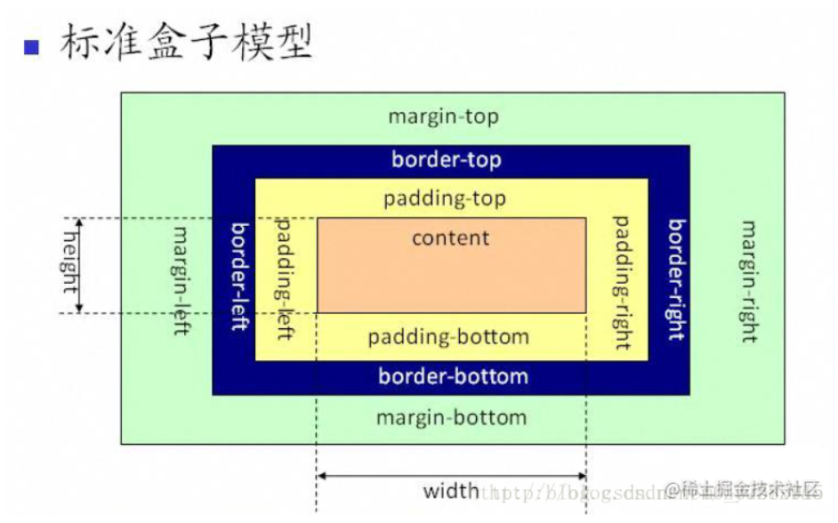
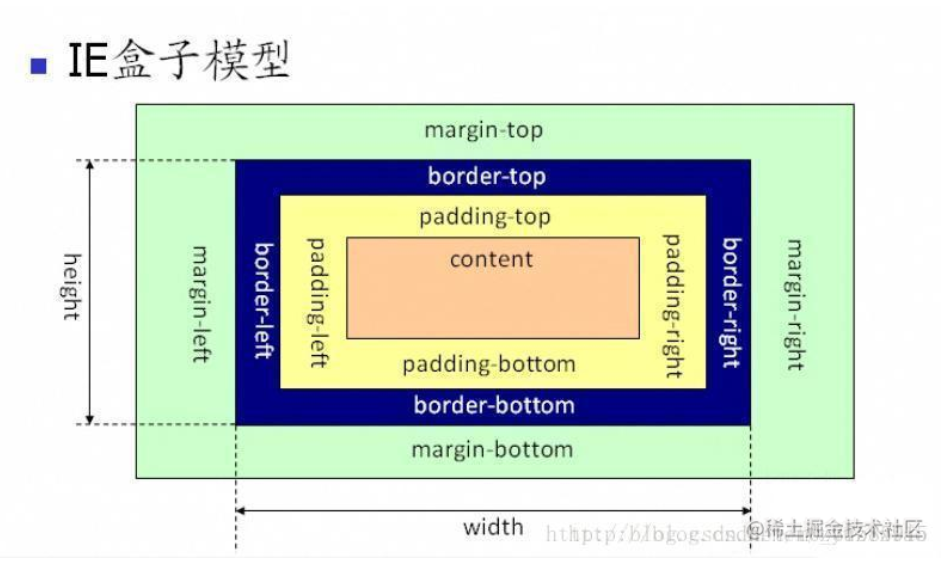

## 选择器

### 并集选择器
    h1,p {color:red}
    将所有h1和p下的文本颜色改为红色
### 后代选择器

    h1 em {color: red}
    将h1下所有的em元素文本颜色改为红色
    
    ol li a {color:red}
    ol下的所有li下的所有a文本改为红色

### 子元素选择器

    h1 > em {color: red}
    
    将h1所有em子元素文本颜色改为红色
    
    ol > li > a {color: red}
    将ol下所有子元素li下所有子元素a的文本颜色改为红色

### 兄弟选择器（没用过）
    h1 + h2 {color: red}
    将紧挨着h1后的h2文本改为红色
    
    h1 + h2 + h3 {color: red}
    将紧挨着h1后的紧挨着h2后的h3元素文本改成红色

## 盒模型
  
  
  

## 伪类伪元素

   ### 静态伪类
   与用户行为无关
   ::first-child 选择第一个子元素
        p::first-child {color: red}  将任何元素的第一个p元素文字颜色改为红色

        p > i::first-child {color:red} 将所有p元素下的第一个i元素文字颜色改为红色
    
        p::first-child i {color:red} 将任何选择器下的第一个p元素下所有的i元素文字颜色改为红色
    ::lang 为不同的语言定义规则
   #### 链接伪类

    a::link {color: blue} 未访问的链接为蓝色
    a::visited {color: red} 已访问的链接颜色为红色
    注意：无href属性的a不受伪类影响 （不常用）
   ### 动态伪类
    多用于根据用户行为改变文档外观
    
    ::focus 拥有输入焦点的颜色
    ::hover 鼠标悬停在文档上的样式
    ::active 被用户激活的元素


   ### 链接伪类顺序
    link-visited-hover-active

   ### 伪元素
   为元素能够在文档中插入假象的元素，从而得到某种效果

   ::first-letter
    p::first-letter {color: red} 将元素p内文本的第一个字符颜色改为红色

   ::first-line
    p::first-line {color: red} 将元素p内文本的第一行文字符颜色改为红色
   ::before
    p::before {content: "{{"} 在p元素之前添入内容 "{{"
   ::after
    p::after {content: "}}"} 在p元素之后添入内容 "}}"

   **before与after创建的伪元素属于行内元素,且必须有content属性**
   #### first-letter 与 first-line 的使用限制
   所允许的属性：
   | first-letter |first-line|
   |--------------|----------|
   |所有font属性   |所有font属性|
   |color   |  color  |
   |background   |  background |
   |所有margin属性   | word-spacing  |
   |所有padding属性  | letter-spacing |
   |所有border属性   | text-decoration  |
   |vertical-align (float:none)   | vertical-align  |
   |text-transform   |  text-transform  |
   |line-height   | line-height  |
   |float   |clear  (仅使用与css2)|
   |letter-spacing (css2.1新增)  | text-shadow  |
   |word-spacing (css2.1新增)   |------------ |
   |clear (仅适用css2)   |------------ |
   |text-shadow (仅适用css2)   |------------ |

   所有伪元素都需放在选择器的最后
   eg:: p:first-child em {color:red} 不合法


## 浮动和定位

   ### 浮动 (float)
   **定义元素相对于其原本位置、父元素、其他元素、浏览器窗口的位置**

   | float |----|
   |-------|----|
   |  值   | left right none inherit|
   |  初始值|  none  |
   | 应用 | 所有元素 |
   | 继承性 |  无  |
   | 计算值  | 根据指定确定   |

   1. 设置浮动的元素会脱离标准流
   2. 若多个元素设置浮动，则按照属性值一行显示且顶端对齐
   3. 浮动元素具有行内块元素特点

   **浮动通常与标准流的父元素配合使用，如父元素上下排列，浮动子元素左右排列**
   **通常一个元素设置了浮动，其余兄弟元素也要设置浮动**

   #### 清除浮动
   当父元素需自动检测子元素的高度时，需要清除浮动
   清除浮动的方法有：
   1. 额外标签

    在浮动元素末尾添加一个空标签,此标签具有属性 style="clear: both|left|right|inherit"
    其中：
        left: 左侧不允许浮动
        right: 右侧不允许浮动
        both: 两侧不允许浮动
        none: 默认值,允许两侧浮动
        inherit: 继承父元素clear属性
   2. 父元素添加overflow属性
      overflow: hidden | auto |scroll
   3. 父元素添加after伪元素
      ```
      .father: { // IE6 7 专有
        zoom: 1
      }
      .father:after {
        content: "";
        display: block;
        height: 0;
        clear: both;
        visibility: hidden
      }
      ```
      相当于升级版的额外标签法
   4. 父元素添加双伪元素
      **浮动元素均会转化为行内块元素**
   ### 定位
    **准确的定义元素框相对于父元素，另一个元素，或浏览器窗口的位置**
    **定位 = 定位模式 + 偏移量**

   | position |----|
   |-------|----|
   |  值   | static relative absolute fixed inherit|
   |  初始值|  static  |
   | 应用 | 所有元素 |
   | 继承性 |  无  |
   | 计算值  | 根据指定确定   |

    - static
        元素框正常生成，无偏移量，遵循标准流规则
    - relative
        元素框位置保留在标准流中，元素相对其原本位置（在标准流中的位置）进行偏移
    - absolute
        元素框脱离标准流，偏移量相对其有定位(relative absolute fixed)的祖先元素或根元素（html）,元素定位后转化为行内块级元素
    - fixed
        元素框表现类似与absolute,偏移量相对与视窗
    - inherit
        position属性与其父元素相同
        **是父元素，而非祖先元素**

## 网页布局

### Flex

Flex 是Flexible Box（弹性盒子）的缩写，用于为盒状模型提供更大的灵活性。
任何一个元素都可以指定Flex布局

```
.box {
    display: flex
}
```
行内元素也可以指定flex布局
```
.inline-box {
    display: flex
}
```

Webkit内核的浏览器设置flex布局时必须加上前缀 -webkit

```
webkit_box {
    display: -webkit-flex
}
```
将元素设置为Flex布局后，其子元素的float,clear,vertical-align属性将失效

设置为flex布局的元素称为 Flex Container，其下的子元素称为Flex Item

### Flex Container属性

| 属性名称        | 值                                            | 效果     |
|----------------|-----------------------------------------------|----------|
| flex-direction | row（默认） row-reverse column column-reverse | 主轴方向  |
| flex-wrap      | nowrap(默认，不换行) wrap（换行，第一行在上） wrap-reverse（换行，第一行在上）  | 是否换行 如何换行|
| flex-flow      |   {flex-direction} {flex-wrap}             | flex-direction与flex-wrap的简写
| justify-content| flex-start(默认，从主轴开始方向排列) flex-end（从主轴结束方向排列） center（居中排列） space-between（两端对齐，items之间间距相同） space-around（items两侧之间间隔相等） | flex items在主轴上的排列方式  |
|align-items | flex-start(从交叉轴起点对齐) flex-end(从交叉轴终点对齐) center（交叉轴中点对齐） baseline（item第一行的基线对齐） stretch（默认值，若未item设置高度/宽度或设置为auto,则沾满整个容器的高度，交叉轴开始方向对齐） | 在交叉轴上的对齐方式 |
| align-content | flex-start flex-end center space-between space-around stretch  | 多行的对齐方式，若items只有一行，则属性无效 | 
|


 #### align-items与align-content的区别 
 因align-items在 Flex Items 多行排列时生效，且当Flex Items在交叉轴方向占满Container时，两者并无差别，故以下只考虑Flex Items多行排列且交叉轴方向扔有剩余空间的情况。以

 ```
 <body>
    <div class="my_block_box">
        <div class="son" style="background:blue;">块子元素1</div>
        <div class="son" style="background:yellow">块子元素2</div>
        <div class="son" style="background:green">块子元素3</div>
        <div class="son" style="background:blue">块子元素4</div>
        <div class="son" style="background:green">块子元素5</div>
        <div class="son" style="background:yellow">块子元素6</div>
        <div class="son" style="background:green">块子元素7</div>
        <div class="son" style="background:blue">块子元素8</div>
    </div>
</body>
    
<style>
    .son {
        height: 50px;
    }
    .my_block_box{
        height: 200px;
        width: 300px;
        background-color: red;
        display: flex;
        flex-wrap: wrap;
        justify-content: center;
        align-items: center; //仅改变了此属性
    }
</style>
 ```
 <image src="../../../assets/img/align_content.png" />
 
**默认为每一行平均分配其占据的高度，每一行的Flex Items在其所在行交叉轴方向居中对齐**

```
<body>
    <div class="my_block_box">
        <div class="son" style="background:blue;">块子元素1</div>
        <div class="son" style="background:yellow">块子元素2</div>
        <div class="son" style="background:green">块子元素3</div>
        <div class="son" style="background:blue">块子元素4</div>
        <div class="son" style="background:green">块子元素5</div>
        <div class="son" style="background:yellow">块子元素6</div>
        <div class="son" style="background:green">块子元素7</div>
        <div class="son" style="background:blue">块子元素8</div>
    </div>
</body>
    
<style>
    .son {
        height: 50px;
    }
    .my_block_box{
        height: 200px;
        width: 300px;
        background-color: red;
        display: flex;
        flex-wrap: wrap;
        justify-content: center;
        align-content: center; //仅改变了此属性
    }
```
<image src="../../../assets/img/align_items.png" />

**将所有行当作一行，交叉轴居中对齐**

 ### Flex items的属性

 | 属性值 | 值 | 效果 |
 | ------- | --------- | --------- |
 | order   | 整数(默认为0) | 按照数值由小到大排列 |
 | flex    |   非负数（默认为0）   | 按照flex的比例分配主轴上的空间   |
 | flex-grow| 非负数（默认0）      | container主轴方向上有剩余空间时，item的放大比例， 0不放大 |
 | flex-shrink | 非负数（默认1）   | container主轴方向空间不足时，item的缩小比例，0不缩小 |
 | flex-basis | \<length> OR auto | 属性定义了在分配多余空间之前，项目占据的主轴空间（main size）(优先级高于height与width,受限制与min-width和max-width)|
 | flex | none OR \<flex-grow> \<flex-shrink> \<flex-basis>(默认为 0 1 auto;该属性有两个快捷值：auto (1 1 auto) 和 none (0 0 auto)。) | flex-grow flex-shrink flex-basis的简写，后两个属性可选 |
 | align-self | auto flex-start flex-end center baseline stretch(默认auto,继承container的align-item属性) | 为项目单独定义对齐方式，与container的align-item效果相同（除auto）  |
